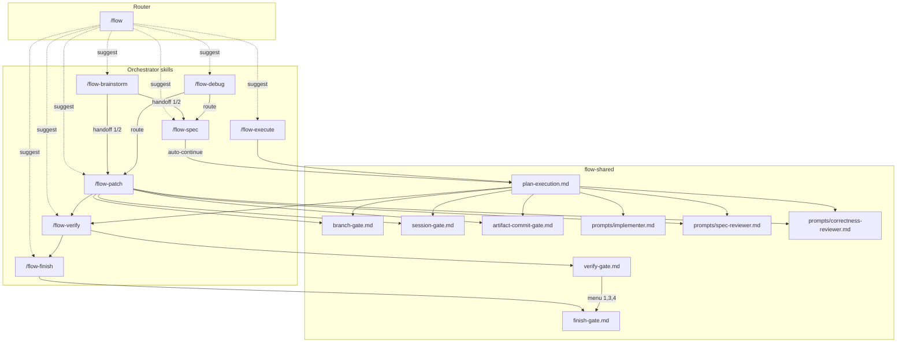
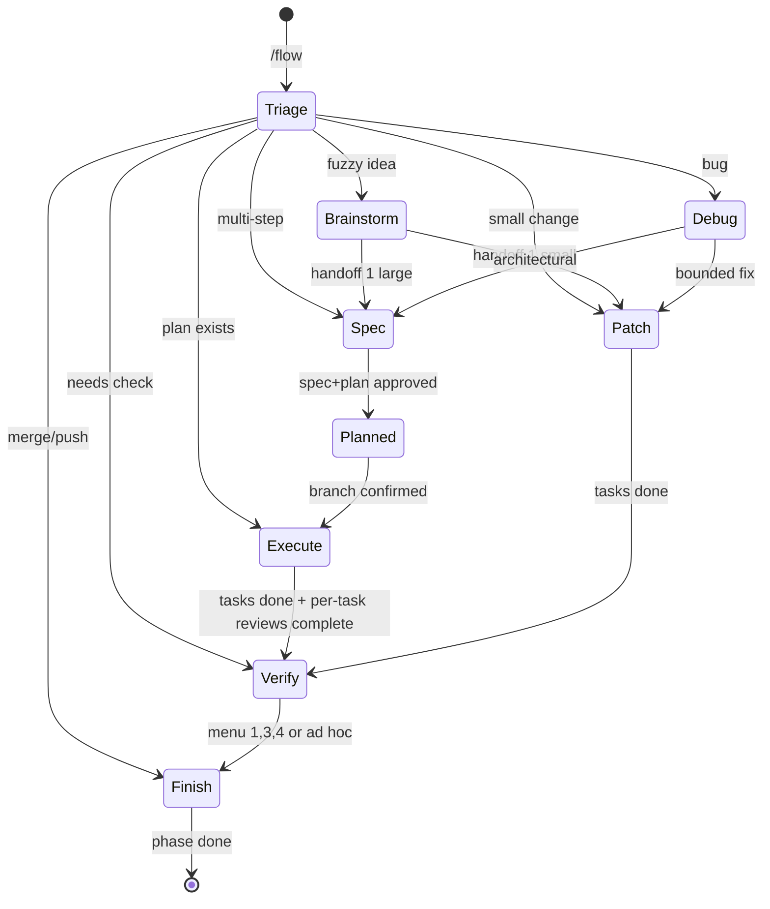

# Flow control plane

**Maintainer map — structure only.** Agents read `skills/**/SKILL.md` and `flow-shared/references/`. This doc answers: *what connects to what, in what order, and what must never break.*

Last synced from skills: review when any routing, gate, handoff, delegation, or invariant behavior changes.

---

## Skills at a glance

| Command | Skill dir | Role | Implements | Never |
|---------|-----------|------|------------|-------|
| `/flow` | `flow/` | Router | Triage → suggest one command | Auto-start child workflows; load child SKILL.md while triaging |
| `/flow-brainstorm` | `flow-brainstorm/` | Explore | Brief → handoff gate | Production code; spec/plan; skip handoff menu |
| `/flow-spec` | `flow-spec/` | Spec + plan | Design gate → spec → plan → auto-continue execute lane | Orchestrator implements tasks; `/flow-execute` handoff after plan |
| `/flow-execute` | `flow-execute/` | Resume execute | Delegates to `plan-execution.md` | Inline implementation |
| `/flow-patch` | `flow-patch/` | Small change | Micro-spec → inline TDD + review | Implementer subagent for code |
| `/flow-debug` | `flow-debug/` | Investigate | Root cause → route patch/spec | Fixes before investigation |
| `/flow-verify` | `flow-verify/` | Verify | Delegates to `verify-gate.md` | Raw merge; auto option 2 |
| `/flow-finish` | `flow-finish/` | Close out | Delegates to `finish-gate.md` | Tests/checklist; `gh` for integration |
| *(internal)* | `flow-shared/` | Shared assets | Prompts + gate refs | Invoked directly |

---

## Router decision tree (`/flow`)

Triage only. **Stop after one suggestion.** User must invoke the target command.

```
User invokes /flow
│
├─ Read docs/flow/STATE.md + user message
├─ Branch mismatch? → suggest cd to matching worktree
├─ Active STATE + unrelated message? → warn; resume or worktree before new brainstorm/spec
│
├─ NEW WORK
│   ├─ Bug or test failure? ──────────────→ /flow-debug
│   ├─ Small bounded (≤3 files, 1 concern)? → /flow-patch
│   ├─ Idea fuzzy / needs exploration? ───→ /flow-brainstorm
│   │       ├─ (after explore) small scope → /flow-patch
│   │       └─ multi-step / multi-concern → /flow-spec
│   ├─ Direction clear, multi-step? ─────→ /flow-spec
│   └─ Plan exists, spec session ended
│       (phase: planned | partial execute)? → /flow-execute
│
└─ IMPLEMENTATION DONE
    ├─ Tests/checklist not confirmed? ────→ /flow-verify
    └─ Verify passed + merge/push/done? ──→ /flow-finish
        (not another /flow-verify)
```

**User already invoked a specific `/flow-*`** → read that skill's SKILL.md; do not triage.

---

## End-to-end lanes

```
SMALL FIX
  /flow-patch → verify (auto) → verify menu → /flow-finish (options 1,3,4)

BUG
  /flow-debug → /flow-patch → verify (auto) → finish

NEW FEATURE (happy path)
  /flow-brainstorm (optional)
    → handoff gate → /flow-spec OR /flow-patch (in-session continue)
  /flow-spec
    → design gate → spec gate → plan (no user gate)
    → branch gate → artifact commit → subagent tasks → verify (auto) → finish

PLAN EXISTS, SESSION ENDED
  /flow-execute → plan-execution → verify (auto) → finish

RE-CHECK
  /flow-verify (standalone)

MERGE / PUSH / SYNC (after green)
  /flow-finish OR verify menu → finish-gate
```

---

## Gate order by command

Gates are **blocking user stops** unless marked *(internal)*. Same-turn bundling with the next step is forbidden everywhere gates apply.

### `/flow-brainstorm`

```
explore → clarify → approaches → design approval
  → session gate
  → save brief + STATE (phase: brainstorm)
  → handoff gate (patch | spec | stop)
  → [if 1 or 2] read flow-patch OR flow-spec; continue in-session
      (does NOT skip micro-spec / design / spec gates downstream)
```

### `/flow-spec`

**Phase A — Spec**

```
explore → clarify (one Q at a time)
  → design proposal → design gate
  → session gate
  → write spec → spec self-review *(internal)*
  → spec gate
  → STATE (phase: spec)
```

**Phase B — Plan** *(automatic after spec approval; no user gate)*

```
scope check → write plan → plan self-review *(internal)* loop
  → STATE (phase: planned)
  → plan-execution step 1 (branch gate)   ← only post-approval pause
  → [after branch confirm] plan-execution steps 2–5 (no /flow-execute stop)
```

### `/flow-execute`

```
plan-execution.md (skip branch gate if STATE.branch confirmed for topic)
  1. session + branch gate (if needed)
  2. artifact commit
  3. load plan
  4. per-task loop (strictly serial — see Per-task review loop)
       each task: implementer → spec ✅ → correctness ✅ → TodoWrite complete
       forbidden: Task N+1 (any role) until Task N both reviews approved
  5. verify auto-run (does not replace step 4 reviews)
```

### `/flow-patch`

```
micro-spec → micro-spec self-review *(internal)* → micro-spec gate
  → session gate → branch gate
  → save patch file + STATE (phase: patch)
  → artifact commit
  → inline TDD + dual review per task
  → verify auto-run
```

### `/flow-debug`

```
session gate (if STATE write needed)
  → Phase 1 investigate (no fixes)
  → Phase 2 hypothesis + minimal test
  → Phase 3 route → /flow-patch | /flow-spec | ask user
  (3 failed patch attempts on same issue → stop patching → spec or user)
```

### `/flow-verify`

```
verify-gate.md:
  verification Iron Law → full test suite → requirements checklist
  → session gate (before STATE)
  → STATE (phase: verify)
  → if fail: /flow-debug or /flow-patch (reviewed fix)
  → if pass: numbered menu (1–4)
  → options 1,3,4 → finish-gate; option 2 → branch review (user-chosen only)
```

### `/flow-finish`

```
finish-gate.md:
  prerequisites (tests green)
  → session gate (before STATE)
  → bare invoke? → finish menu (stop until pick)
  → merge | push | remote sync | done for now
  → artifact cleanup gate (after local merge or remote sync)
```

---

## Cross-cutting gates (shared refs)

| Ref | When loaded | Hard rule (summary) |
|-----|-------------|---------------------|
| `session-gate.md` | Before any `STATE.md` write | No STATE write until session confirmed; unrelated work → stop |
| `state-setup.md` | Before first STATE write | Offer gitignore for `docs/flow/STATE.md` |
| `branch-gate.md` | Before git mutation / Task 1 | No implementation until branch + workspace confirmed |
| `worktree-setup.md` | User picks worktree | Gitignore dir before `git worktree add` |
| `artifact-commit-gate.md` | After branch confirm, before Task 1 | Commit flow artifacts on feature branch only |
| `plan-execution.md` | spec auto-continue, `/flow-execute` | Subagents only; **dual review per task**; serial tasks; auto verify **after** all task reviews |
| `verify-gate.md` | end of execute/patch, `/flow-verify` | Fresh full suite; numbered menu only |
| `finish-gate.md` | `/flow-finish`, verify menu 1/3/4 | No raw merge; git-only remote sync check |
| `tdd-red-green.md` | patch inline, plan tasks | Behavior → RED-GREEN; presentation → manual |
| `verification-gate.md` | via verify-gate step 1 | No completion claims without evidence |
| `root-cause-tracing.md` | debug deep stacks | Trace backward before fixes |

**Path resolver** (all skills): resolve `flow-shared` from first match:

1. `.agents/skills/flow-shared/`
2. `.cursor/skills/flow-shared/`
3. `~/.cursor/skills/flow-shared/`

---

## Execute vs patch (core split)

| | `/flow-execute` + `plan-execution` | `/flow-patch` |
|---|-----------------------------------|---------------|
| **Scope** | Multi-task plan | ≤3 files, one concern |
| **Who codes** | Implementer **subagent** | Orchestrator **inline** |
| **Spec artifact** | `docs/flow/specs/` + `plans/` | Inline micro-spec → `docs/flow/patches/` |
| **Reviews** | Subagent spec + correctness per task | Dispatch reviewers; orchestrator fixes inline |
| **After tasks** | Auto verify | Auto verify |
| **Forbidden** | Orchestrator edits `src/`/`tests/` for tasks | Implementer subagent for code |

---

## Per-task review loop (execute + patch)

Serial — Task N+1 starts only after Task N completes all steps.

```
Execute (subagents):
  implementer → spec reviewer ✅ → correctness reviewer ✅ → TodoWrite complete

Patch (inline):
  orchestrator TDD → spec reviewer ✅ → correctness reviewer ✅ → commit → TodoWrite complete

Both:
  Block/Fix from correctness → spec review again on new diff → then correctness
  Never git checkout SHA (diff anchors only)
  One commit per task (patch: per micro-spec step 5)
```

**Not valid (no exceptions):**

- Implementer DONE or per-task tests green → skip spec or correctness review
- Spec ✅ only → start Task N+1 before correctness ✅ Approved
- Parallel Task N+1 implementer while Task N review still running
- End verify (full suite) → substitute for per-task diff reviews
- Auto-continue / continuous execution → skip reviews or parallel tasks (continue **gates**, not throughput)

**Orchestrator:** Re-read `plan-execution.md` §4 task gate checklist before **each** Task N dispatch.

---

## Delegation graph



---

## STATE.md (session bookmark)

**Location:** `docs/flow/STATE.md` in **consumer project** (not maintainer repo). **Gitignore recommended.**

```yaml
phase: brainstorm | spec | planned | execute | patch | debug | verify | done
brainstorm: docs/flow/brainstorms/...
spec: docs/flow/specs/...
plan: docs/flow/plans/...
patch: docs/flow/patches/...
workspace: in-place | worktree
worktree: .worktrees/feature-topic   # when worktree
branch: feature/topic
updated: YYYY-MM-DD
```

| phase | Occupied? | Typical next command |
|-------|-----------|----------------------|
| brainstorm, spec, planned, execute, patch, debug, verify | yes | resume matching skill |
| done / missing | no | new work allowed |

**Worktree rule:** STATE lives in the worktree cwd during implementation — not main + worktree both.

**Tracked artifacts:** brainstorms, specs, plans, patches (in git). STATE is ephemeral.

---

## Architectural invariants

Edit these only with scenario RED → skill GREEN → `make test`.

| ID | Invariant |
|----|-----------|
| I1 | `/flow` triages only — suggest one command, then **stop** |
| I2 | `/flow-execute` and spec auto-continue = **subagents only** for plan tasks |
| I3 | `/flow-patch` = **inline** implementation; no implementer subagent |
| I4 | Branch gate before Task 1 and before git mutations |
| I5 | Session gate before STATE write on unrelated work |
| I6 | Artifact commit on feature branch before Task 1 |
| I7 | Spec auto-continue: **no** `/flow-execute` handoff after plan or branch confirm |
| I8 | Execute/patch auto-run verify — **no** "invoke `/flow-verify`" handoff |
| I9 | Verify finish = **numbered menu** from verify-gate; no ad hoc merge menu |
| I10 | Finish actions via finish-gate — no raw `git merge` for active flow work |
| I11 | Remote merge sync = git fetch + merge-base only — **no `gh`** |
| I12 | Correctness Block/Fix → **re-run spec review** before correctness |
| I13 | Never `git checkout <SHA>` for task work (detached HEAD) |
| I14 | `flow-shared` not invoked directly — path resolver only |
| I15 | Brainstorm handoff continues **in-session** — no "run `/flow-patch`" text |
| I16 | Task N+1 (any subagent role) only after Task N spec ✅ and correctness ✅ Approved |
| I17 | Execute/patch auto-verify does **not** waive per-task spec + correctness reviews |

**Checked by:** `tests/static/validate-skills.sh` verifies this map exists and lists I1-I17. Behavioral enforcement lives in skill text plus `tests/scenarios/` pressure cases.

---

## Scope routing (brainstorm / spec / patch)

| Criteria | Route |
|----------|-------|
| ≤3 files, one concern, clear success | `/flow-patch` |
| >3 files OR multiple concerns OR multi-step | `/flow-spec` |
| Requirements still fuzzy | `/flow-brainstorm` (or redirect from spec) |
| Bug / failing test | `/flow-debug` |
| Plan approved, spec session ended | `/flow-execute` |

**During spec:** if scope is small bounded → agent reads `flow-patch/SKILL.md` and follows patch **in-session** (no user re-invoke).

---

## Consumer vs maintainer repo

| | Maintainer (`flow-skillset`) | Consumer project |
|---|------------------------------|------------------|
| Skills | `skills/` | `.agents/skills/` or `.cursor/skills/` |
| This map | `docs/control-plane.md` | — |
| Human workflow doc | `docs/workflow.md` | — |
| Flow artifacts | `tests/fixtures/` only | `docs/flow/{brainstorms,specs,plans,patches}` |
| STATE | — | `docs/flow/STATE.md` (local) |

---

## When you change Flow

**Maintainer order (see `AGENTS.md`):** Step 1 — review or update **this file with the user** (unless a Step 1 exception applies). **Halt until the human confirms** the map; do not proceed to scenarios or `skills/` in the same turn. Then Iron Law scenario RED → skill GREEN for discipline/gate changes.

| Change type | Edit first | Then | Test |
|-------------|------------|------|------|
| Routing / handoff | This file (user review) | `flow/SKILL.md` + affected skills | scenario RED/GREEN if behavior changes |
| New gate | This file gate order (user review) | shared ref + orchestrator skill | scenario RED/GREEN |
| Wording only | Confirm no map change with user | `SKILL.md` or ref directly | `make test` |
| New invariant | This table (user review) | skill prose + `validate-skills.sh` if grep-able | scenario RED/GREEN |

**Do not** regenerate all skills from this map in one AI pass — sync surgical slices, review diff.

---

## Quick mermaid — phase flow



---

## Files to open for common questions

| Question | Read |
|----------|------|
| Where does routing live? | `skills/flow/SKILL.md` |
| Full spec/plan pipeline? | `skills/flow-spec/SKILL.md` |
| Subagent task loop? | `skills/flow-shared/references/plan-execution.md` |
| Inline patch loop? | `skills/flow-patch/SKILL.md` |
| Branch/worktree matrix? | `skills/flow-shared/references/branch-gate.md` |
| Verify menu options? | `skills/flow-shared/references/verify-gate.md` |
| Merge/push/sync? | `skills/flow-shared/references/finish-gate.md` |
| How to change safely? | `tests/writing-skills.md`, `AGENTS.md` |
| User-facing summary? | `README.md`, `docs/workflow.md` |
